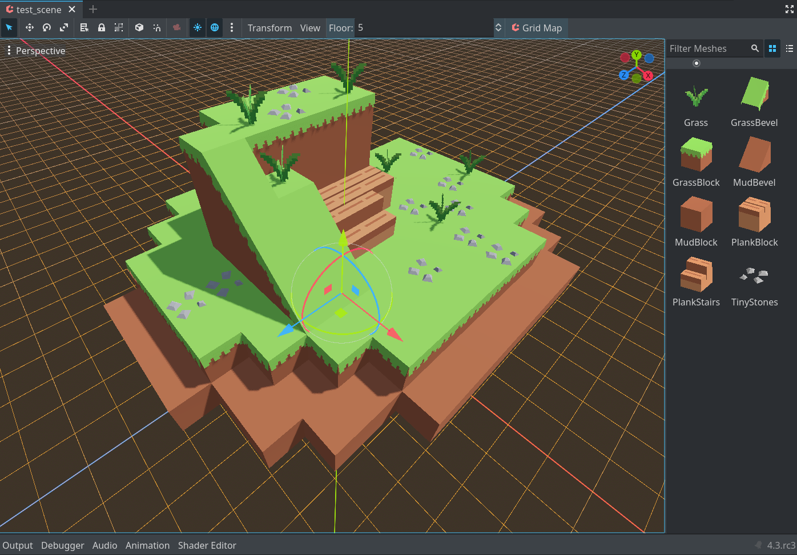
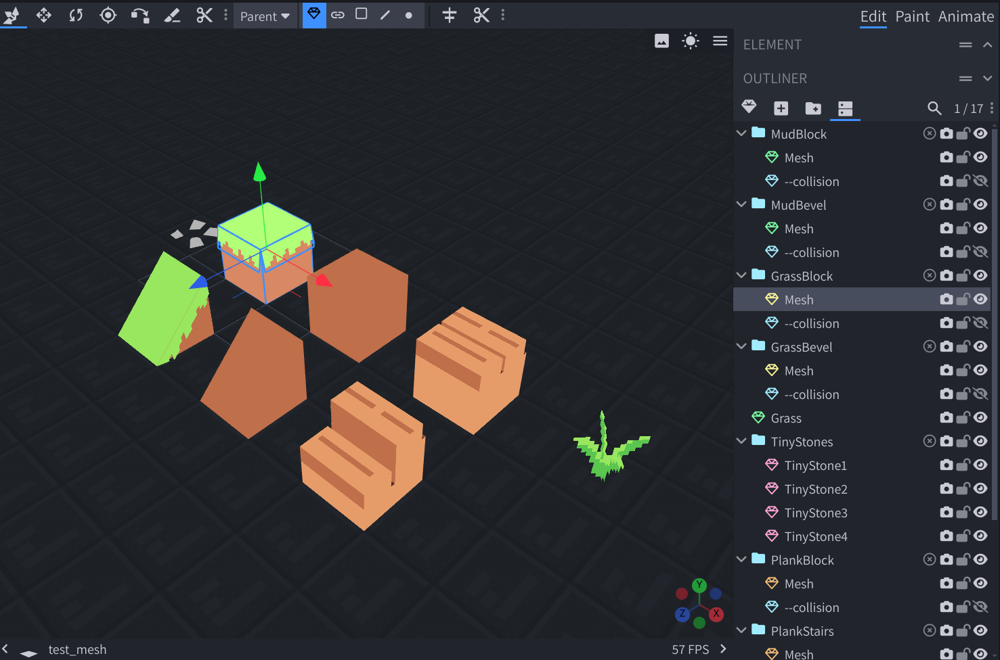

# GLTF2MeshLib

This plugin allows you to import gltf/glb models as MeshLibrary, which saves a lot of time compared to manual importing.

## Usage

you can simply drag and drop gltf/glb files into the editor, select "`GLTF To MeshLibrary`" in the import settings, and it will automatically import your gltf/glb as a MeshLibrary. This allows you to see instant changes after any modification of the gltf file.

In my case, I used models made with Blockbench, exported as gltf, and imported into Godot with this plugin, and it seems to work fine as I expected. I am using `Godot 4.3`.

If you encounter any problems, or if you have any suggestions, please let me know in the Issues.

### Modes

gltf2meshlib has 2 import modes: `import_mesh_only` and `import_hierarchy`.

the first mode behaves just like what Godot Editor does: it imports all Mesh Nodes into separated Item of MeshLibrary.

the second mode would consider hierarchy structure of nodes: that means, if one of your object are composed with multiple Meshs (eg. a large "stones" block consists of 4 small stone meshes), this mode would import them into one single Item, rather than 4 tiny Items.

you can change the mode by switching import args `"import_hierarchy"`.

### Flags

Now you can import Items with flags. Currently there're 2 kinds of flags available:

| Flag                    | Description                                                                |
| ----------------------- | -------------------------------------------------------------------------- |
| `--collision` or `-col` | whether to import this object as collision shape or not. false by default. |
| `--noimp`               | whether to import this object or not. false by default.                    |

Here's an example:

You can configure collision by adding meshes that indicates the collision shape of the item, and add `--collision` flag to the item.

## Issues

for some reason, the editor might raise annoying "Attempted to call reimport_files() recursively, this is not allowed." error while importing mesh as MeshLibrary. Maybe there's still some issues with my code.

let me know more problems you encountered in issues.

## Contributors

please view the "contributors" page on the right side(if you are reading this via github).

## License

License under MIT License.
